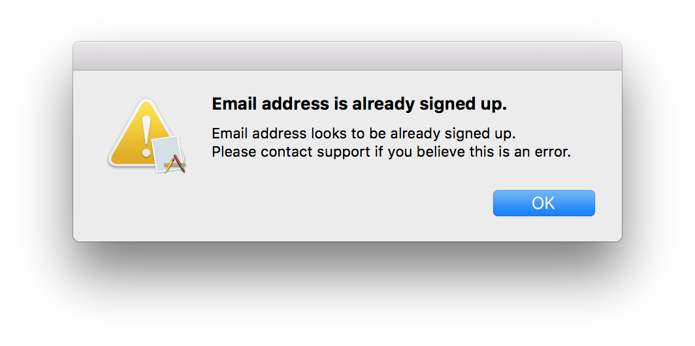

## MPMailingListService [](https://github.com/Carthage/Carthage)

- `MailingListService`: Mailchimp based mailing list signup service, backed by ChimpKit3.
- `MailingListSignupViewController`: a macOS view controller that can be placed in a window controller to act as a ready-made solution UI f.
- `Mailing List Example.app`: an example app that demonstrates using `MailingListSignupViewController`.


<br/>


#### INSTALLATION

##### Carthage

[Carthage](https://github.com/Carthage/Carthage) is a decentralized dependency manager that builds your dependencies and provides you with binary frameworks.

You can install Carthage with [Homebrew](http://brew.sh/) using the following command:

```bash
$ brew update
$ brew install carthage
```

To integrate MPMailingListService into your Xcode project using Carthage, specify it in your `Cartfile`:

```ogdl
github "mz2/MPMailingListService" ~> 0.0.1
```

Run `carthage update` to build the framework and drag the built `MPMailingListService.framework` into your Xcode project.

### Manually

If you prefer not to use either of the aforementioned dependency managers, you can integrate MPMailingListService into your project manually.

#### Embedded Framework

- Open up Terminal, `cd` into your top-level project directory, and run the following command "if" your project is not initialized as a git repository:

```bash
$ git init
```

- Add MPMailingListService as a git [submodule](http://git-scm.com/docs/git-submodule) by running the following command:

```bash
$ git submodule add https://github.com/mz2/MPMailingListService.git
```

- Open the new `MPMailingListService` folder, and drag the `MPMailingListService.xcodeproj` into the Project Navigator of your application's Xcode project.

    > It should appear nested underneath your application's blue project icon. Whether it is above or below all the other Xcode groups does not matter.

- Select the `MPMailingListService.xcodeproj` in the Project Navigator and verify the deployment target matches that of your application target.
- Next, select your application project in the Project Navigator (blue project icon) to navigate to the target configuration window and select the application target under the "Targets" heading in the sidebar.
- In the tab bar at the top of that window, open the "General" panel.
- Click on the `+` button under the "Embedded Binaries" section.
- Select the `MPMailingListService.xcodeproj` nested inside a `Products` folder now visible.

> The `MPMailingListService.framework` is automagically added as a target dependency, linked framework and embedded framework in a copy files build phase which is all you need to build on the simulator and a device.

(This manual installation section was shamelessly ripped from the excellent [Alamofire](github.com/alamofire/Alamofire) instructions.)

#### USAGE

The best way to learn how to use this code is to build the example app:

1. Build the ChimpKit dependency: `git submodule update --init --recursive; carthage build`
2. Choose the scheme "Mailing List Example" in `MPMailingListService.xcodeproj`.
3. Build and run.